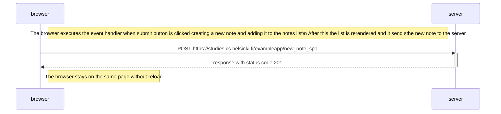

```mermaid
sequenceDiagram
    participant browser
    participant server
    
    Note right of browser: The browser executes the event handler when submit button is clicked creating a new note and adding it to the notes list\n After this the list is rerendered and it send sthe new note to the server

    browser->>server: POST https://studies.cs.helsinki.fi/exampleapp/new_note_spa
    activate server
    server-->>browser: response with status code 201
    deactivate server
    
    Note right of browser: The browser stays on the same page without reload
```